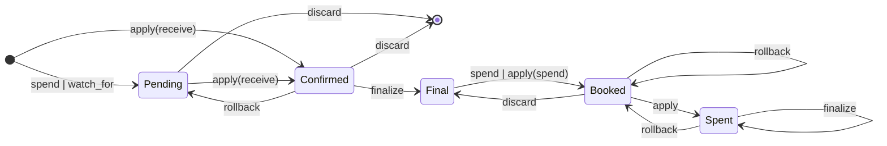
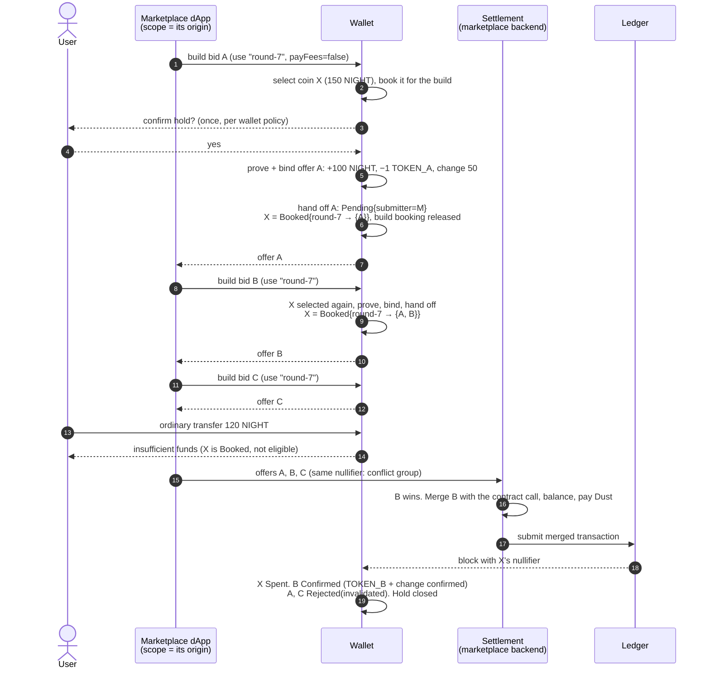
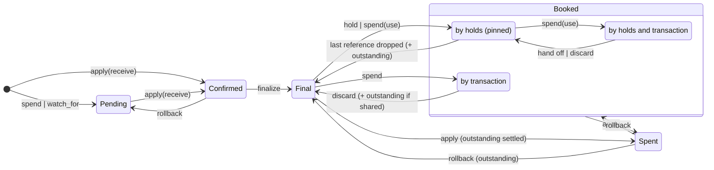
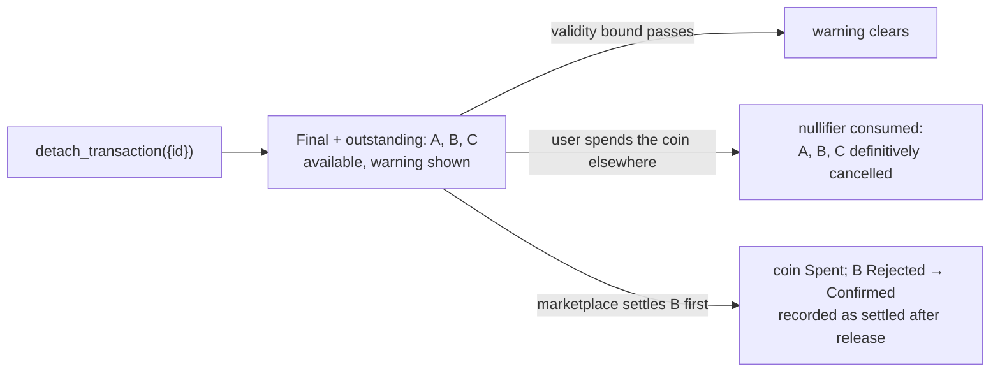

# Holds and pinned coins for Midnight wallets

**Status:** proposal, draft for review. Not yet submitted upstream.
**Target:** the [Midnight Wallet Specification](https://github.com/midnightntwrk/midnight-wallet/blob/main/docs/spec/Specification.md), section *State management*.
**Documents:** this README explains the proposal, how it works and what it enables. [SPECIFICATION.md](SPECIFICATION.md) holds the exact normative text and requirements. [upstream/](upstream/) contains the same text as a patch against the wallet specification.

## Summary

Midnight's Zswap was built for offers: a party builds a proven, purposefully unbalanced shielded offer, and whoever
holds that offer can balance it and complete the transaction, permissionlessly.

Wallets, however, can only reserve a coin for a transaction they will submit themselves. The reservation exists to
avoid the case where one coin is sent to two recipients: only the first transaction submitted is accepted, the other is
rejected.

Consider a bid. There are several equivalent items, you want to bid 100 tokens on each of them, and you only have 100
tokens. We want to enable this use case.

This proposal extends the internal wallet state so that a coin can be reused knowingly, and so that the wallet knows
when a coin can be reused and when it cannot. It adds no new coin state and no new transaction status: existing states
gain metadata, and wallets that ignore the metadata keep behaving correctly.

In one table, for a single coin **X**. A, B, C and D are transactions the wallet builds from X and hands to the
application (candidates). r7 and r8 are identifiers the application chooses. M is the scope: the application's
identity as authenticated by the wallet, its web origin in a browser.

| Step | X.state | Pins on X: id → live candidates | Outstanding (may still settle) |
|---|---|---|---|
| initially | Final | – | – |
| build A with `use: r7` | Booked | r7 → {A} | – |
| build B, C with `use: r7` | Booked | r7 → {A, B, C} | – |
| build D with `use: r7, mark: r8` | Booked | r7 → {A, B, C}, r8 → {D} | – |
| `detach_transaction(D)` | Booked | r7 → {A, B, C} | D |
| `detach_transaction({id: r7})` | Final, warning shown | – | A, B, C, D |
| A's and B's validity bounds pass | Final, warning shown | – | C, D |
| C settles on chain | Spent | – | – (C `Rejected → Confirmed`, D invalidated) |

An ordinary transfer, from the user or from any other application, never selects X while it is `Booked`. After the
second detach, X is spendable again; spending it would have cancelled C and D definitively. Had the application known
that D was never sent anywhere, `detach_transaction(D, { force: true })` would have dropped it without the memory.

## The problem

The wallet specification reserves coins through *booking*: `spend` moves a coin from `Final` to `Booked`; when the
transaction settles the coin becomes `Spent`; when the wallet gives up (`discard_transaction`) the coin returns to
`Final`. Booking is binary and single-purpose. A bidding application needs three things it cannot provide:

| Need | Why booking fails |
|---|---|
| Bid on products A, B and C with the same 100 NIGHT; whichever bid the seller accepts first takes the funds | One coin can be booked for one transaction |
| Hand the offer to the marketplace and keep using the wallet | Once the offer leaves, the wallet must keep it pending forever (blocking the coin for everything) or discard it (un-booking the coin) |
| Stay safe while bids are out | An unrelated transfer, or another dApp's balancing request, can spend the coin and silently invalidate every bid |

And a privacy requirement: the marketplace that collected the bids may know they conflict, but no other application
should learn that funds are reserved, for what, or how many offers exist.

## Current states

The wallet specification today tracks coins in five states and transactions in four statuses. Booking is the only
reservation mechanism: a coin is booked for exactly one transaction and released the moment that transaction is
discarded.

| Coin state | Meaning | Counted in |
|---|---|---|
| `Pending` | expected to be received (change of an own transaction, or `watch_for`) | pending balance |
| `Confirmed` | received in a transaction added to the chain, not yet final | pending balance |
| `Final` | received in a finalized transaction | available balance |
| `Booked` | reserved for one transaction the wallet is building or has submitted | nothing |
| `Spent` | its nullifier was observed on chain | nothing |

| Transaction status | Meaning |
|---|---|
| `Pending` | built by the wallet (`spend`) or expected (`watch_for`); submitted and re-submitted by the wallet until its TTL |
| `Confirmed` | observed in a block, with its execution result (success, partial success, failure) |
| `Final` | confirmed and finalized |
| `Rejected` | discarded by the wallet, or dropped by a reorganization |

Transitions: `Pending → Confirmed` on `apply`, `Confirmed → Final` on `finalize`, `Confirmed → Pending` on `rollback`,
`Pending | Confirmed → Rejected` on `discard`. There is no status for a transaction the wallet built but will not
submit, and a `Rejected` transaction is never expected to confirm.

## Proposed changes

### 1. Metadata on existing states

| State | Metadata added | Meaning |
|---|---|---|
| `Booked` | booking record `{transaction?, holds}` where `holds` maps `(scope, id)` to a set of **references** | `transaction` is today's booking. A reference is one live candidate built from the coin under that id (or a reservation made with `hold`), carrying the candidate's on-chain components and validity bound. A coin with any reference is **pinned**; the count of an id on the coin is the size of its set. Pinned coins count only in the owning scope's `held` balance |
| `Final` | `outstanding` list | dropped candidates and discarded-but-shared transactions that could still consume the coin. The coin **is available**; the wallet warns |
| `Pending` | `submitter` = wallet or scope | a scope-submitted pending transaction is a **candidate**: built by the wallet, handed off, never submitted or re-submitted by the wallet, excluded from the pending balance and from TTL discarding |
| `Rejected` | `reason`, validity bound | `discarded`, `detached`, `invalidated`, `stale`, `expired`; keeps the bound while the transaction may still settle |

One edge is added that today's lifecycle lacks although it already happens in practice: `Rejected → Confirmed` on
`apply`, for a transaction the wallet gave up on that another party submits before its validity bound passes.

### 2. Holds

A **hold** is keyed by (**scope**, **id**).

- The **scope** says on whose behalf the coins are reserved. It is derived by the wallet, never supplied by the caller:
  the wallet user, or one connected application identified by its authenticated origin together with the wallet and
  network identifiers.
- The **id** is chosen by the application. It is a label, not a capability: unique only within its scope, shared
  freely by many coins and many transactions, never interpreted by the wallet.
- A hold is a policy: `expires_at` for reservations and an optional `note`. Its coins (shielded coins, Dust included,
  and unshielded UTxOs) are found through their booking records; one coin may carry references under several ids of
  the same scope. How many candidates an id backs is the application's choice: a one-shot candidate uses an id that
  is never reused.

### 3. Authorization on `spend`

A build may carry `use: X` and, optionally, `mark: Y` (defaulting to X):

- If no hold (scope, X) exists yet, it is created implicitly and coins are selected from unpinned final coins.
- Otherwise coins pinned under (scope, X) are selected first; if they do not cover the request, unpinned coins are
  added.
- Every selected coin, found or added, gets this build's reference under (scope, Y): the count of Y on the coin grows
  by one. With the default Y = X that is simply "one more bid with X"; `use: r7, mark: r8` knowingly backs a round-8
  bid with round-7's coins. Coins pinned only under other ids are never taken.
- The finished transaction is handed to the scope; the transaction booking is released and the pins keep the coins
  reserved.

Without an authorization, coin selection works exactly as today and never touches booked coins.

### 4. Two operations

- `hold(scope, id, selection, policy)` — reserve coins up front without building anything (a `reservation` reference
  that lapses at `expires_at`), or set the policy before the first build creates the hold implicitly.
- `detach_transaction(transaction | {id}, {force?})` — drop one candidate, or every candidate and the reservation
  under an id: remove the references from the coins, mark the candidates `Rejected(detached)`, and remember them as
  `outstanding` while they could still settle. `force: true` skips the memory when the caller knows the candidate was
  never made public. A coin whose last reference goes returns to `Final` with a warning. Both forms are idempotent.
  Expiry needs no operation: references are pruned when their validity bound passes.

`apply_transaction`, `rollback_last_transaction` and `discard_transaction` are amended to settle, invalidate and
restore candidates, and to attach `outstanding` entries where a discarded transaction may have left the wallet.

## How it works

### Bidding flow

Another dApp asking the wallet for balances at any point before step 18 sees X neither as available nor as held. It cannot tell a
pinned coin from a spent one.

### Coin lifecycle with the metadata

The same diagram as PlantUML, together with the transaction lifecycle, is in [diagrams/](diagrams/).

### Cancelling

Today the wallet's only cancel is local: it un-books the coin and marks the transaction rejected. An offer that already
left the wallet stays valid to whoever holds it until its validity bound passes. If the recipient submits it after the
local cancel, today's wallet sees an unexplained spend.

The proposal keeps the user's intent and adds the missing memory:

Spending the coin is the only definitive cancellation; the wallet may offer detach plus an immediate self-transfer as
a "cancel" convenience. When the caller knows a candidate was never made public, `force: true` drops it with no
memory at all.

### Validity of a candidate

Every candidate has a bound after which the ledger refuses it. The application can compute it without the wallet's
help: root retention is a fixed network parameter (changing it is a hard fork) and the intent TTL is chosen at build
time. The application rebuilds with `use` before the bound passes; the wallet does not prompt the user again.

| Inputs | Bound | Enforced by |
|---|---|---|
| Shielded coins, including Dust | commitment-tree root retention: 3600 s hard-coded on ledger v8; `global_ttl` parameter on ledger v9 (code default 3600 s, deployed value to be confirmed on a node 2.x network) | ledger `past_roots` (Dust: its own commitment and generation trees) |
| Unshielded UTxOs | the TTL of the intent that carries them, chosen at build time within the ledger's allowed margin | ledger intent TTL |

Dust is a shielded coin for every purpose here; the only thing that sets it apart is that it cannot be transferred.
A candidate that spends both shielded and unshielded inputs is bound by whichever of the two passes first.

A candidate past its bound can never settle, so it becomes `Rejected(stale)` or `Rejected(expired)` and needs no
`outstanding` entry.

## Use cases

**Bidding on several products with the same funds.** The flow above. The marketplace collects one offer per product,
sees the shared nullifier, and knows it may settle at most one of them. The user's other funds stay usable throughout.

**Token launches: whichever reaches its goal first takes the funds.** The user commits the same NIGHT to several new
tokens. Each candidate is an offer providing NIGHT and receiving a token the wallet has never held; the launch contract
mints the aggregate and absorbs the NIGHT in one merged, all-or-nothing transaction. The first launch to reach its goal
settles; the others are invalidated automatically.

**Deferred payment with a fixed ceiling.** A service asks the user to pre-authorize up to 50 NIGHT for a session. The
dApp calls `hold` with an amount, then builds the final charge later with `use`; the user's remaining balance is
spendable meanwhile, and the reservation lapses if nothing is charged.

**Order-book style swaps.** Offer files ([MIP-0005](https://github.com/midnightntwrk/midnight-improvement-proposals/blob/main/mips/mip-0005-offer-files.md))
and P2P swap discovery ([MIP-0006](https://github.com/midnightntwrk/midnight-improvement-proposals/blob/main/mips/mip-0006-p2p-atomic-swaps.md))
already let a wallet publish an offer for someone else to take. Holds give the publishing wallet a correct local model
of that offer: the coin is protected while the offer is live, the offer is recognized when taken, and cancellation has
the semantics MIP-0006 describes (spend the coin).

**Unshielded deferred transactions.** The same lifecycle covers a signed intent held back for later submission by a
service, expiring at its TTL.

## Privacy

- `available` excludes every pinned coin for every observer, including the owning scope; pinned coins are `Booked`.
- `held` is reported per scope: a dApp sees the amount pinned for it and nothing about other scopes' holds.
- All balances are computed by one function regardless of who owns the pins. A scope that does not own a hold cannot
  distinguish a pinned coin from a spent one.
- Hold identifiers resolve only within the requesting scope. A foreign id finds nothing, exactly as a never-used id.
- Candidates contain only ledger data; hold ids, notes, scope identity and the existence of other holds never appear
  in transactions, dApp-visible history, logs or errors.
- Inside the owning scope, shared nullifiers across candidates are visible on purpose: the marketplace must not merge
  two conflicting bids, or the ledger rejects the double spend and the whole guaranteed section with it.

## What this proposal does not do

- It locks nothing on chain. A pin is wallet policy; the only on-chain effect is the transaction that finally spends
  the coins.
- It adds no second execution tracker; settlement detection reuses the wallet's existing nullifier matching.
- It does not define dApp connector method signatures or origin authentication. Those belong to the connector and
  will be specified with the MIP that follows this review.

## Repository layout

| Path | Content |
|---|---|
| [README.md](README.md) | this document |
| [SPECIFICATION.md](SPECIFICATION.md) | normative text, requirements checklist, conformance scenarios |
| [upstream/midnight-wallet-specification.patch](upstream/midnight-wallet-specification.patch) | the proposal as a diff against `midnightntwrk/midnight-wallet` `docs/spec` at `6e1050e5` |
| [upstream/commits/](upstream/commits/) | the same change as individual commits |
| [diagrams/](diagrams/) | PlantUML sources and rendered SVGs of the coin and transaction lifecycles |
| [tools/assemble-spec.py](tools/assemble-spec.py) | regenerates SPECIFICATION.md sections 1–4 from the upstream branch, so the two cannot diverge |

## Open points for reviewers

None at the moment. Earlier open points (hold mode vs. count, exposing network parameters, fee shortfall on
fee-paying candidates, segment-id collisions, implicit-hold defaults) were resolved by simplifying the model: there is no
hold mode, the wallet exposes no network parameters, and fee and segment-id handling belong to the settlement design,
not to the wallet state.

## License

Apache-2.0. See [LICENSE](LICENSE).
